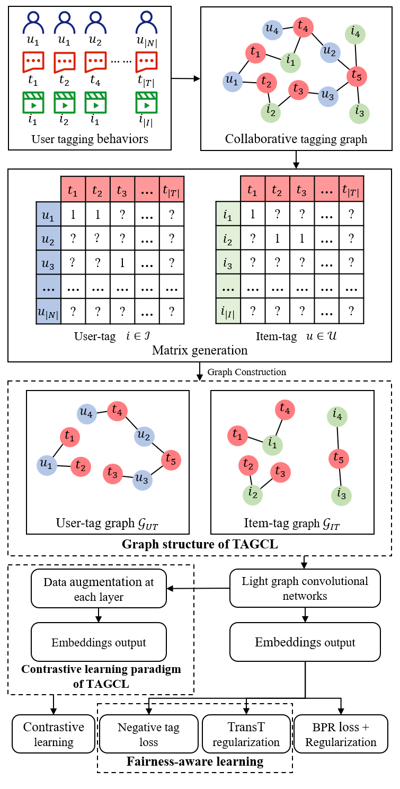

# A Fairness-aware Graph Contrastive Learning Recommender Framework for Social Tagging Systems

[[Paper](https://www.sciencedirect.com/science/article/pii/S0020025523006497)]



## Dependencies
- PyTorch 1.12.0
- RecBole 1.0.1
- torch-geometric 2.0.4
- matplotlib 3.5.2
- Scipy 1.6.0

## Citation

```
@article{xu2023tagcl,
title = {A fairness-aware graph contrastive learning recommender framework for social tagging systems},
journal = {Information Sciences},
pages = {119064},
year = {2023},
issn = {0020-0255},
doi = {https://doi.org/10.1016/j.ins.2023.119064},
url = {https://www.sciencedirect.com/science/article/pii/S0020025523006497},
author = {Can Xu and Yin Zhang and Hongyang Chen and Ligang Dong and Weigang Wang},
```